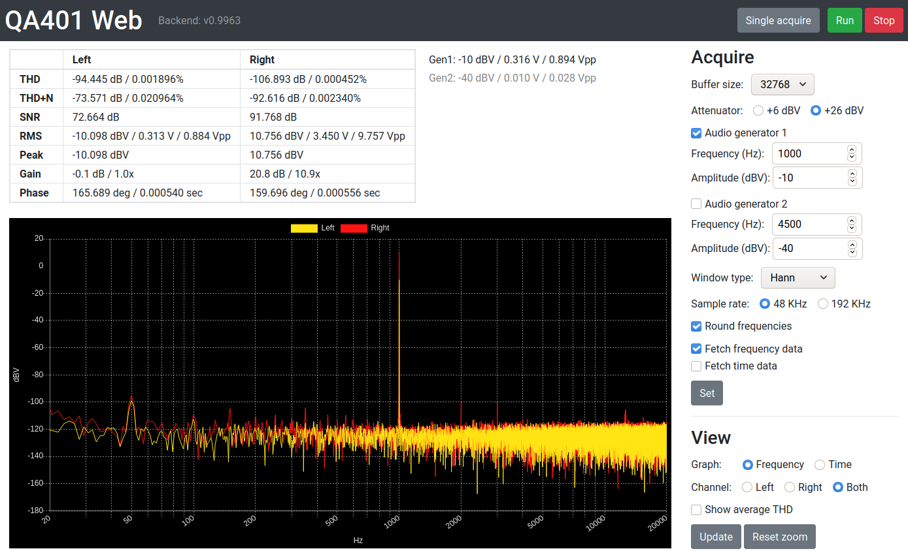

# QA401 Web

Simple web interface for usage with the [QA401H](https://github.com/QuantAsylum/QA401H) REST API for the [QA401 Audio Analyzer](https://quantasylum.com/products/qa401-audio-analyzer). This allows a visual interface on Linux.

Due to missing CORS headers in the REST API it will not work by default. I currently use a [proxy](https://github.com/Shivam010/bypass-cors/) as a workaround.

## How to use

1. Download and start QA401H
2. Download/build/start a CORS bypass proxy
3. Open [index.html](index.html) in the browser

If you use a proxy that does not run on `http://localhost:8080` you can change the basePath in [qa401.js](js/qa401.js).
