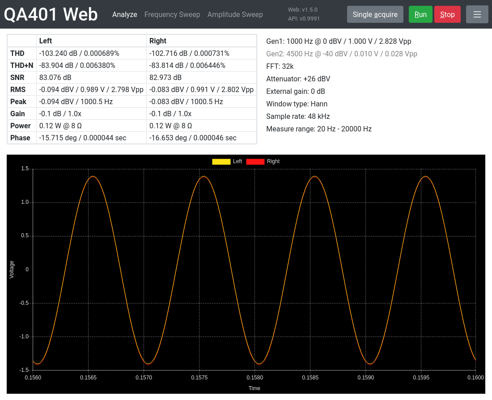
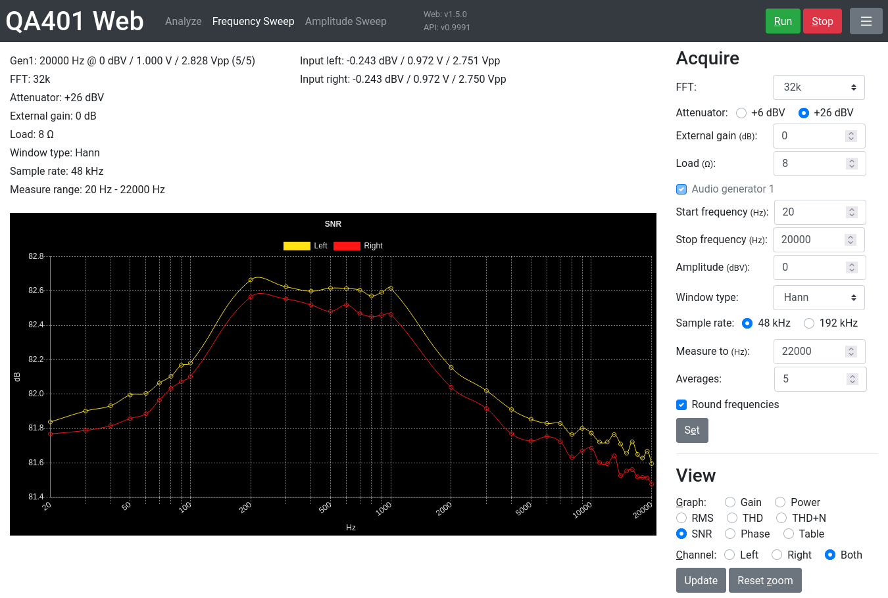
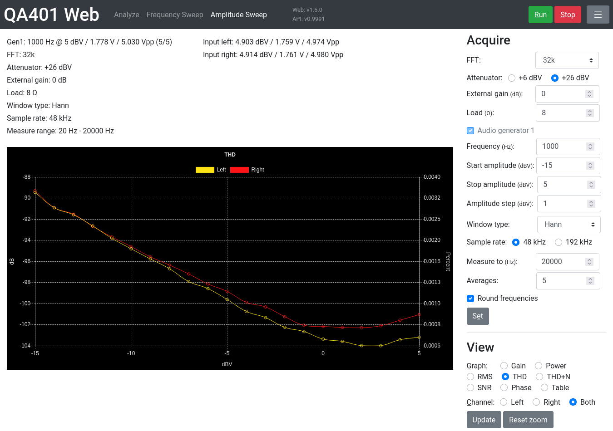

# QA401 Web

Unofficial web interface for usage with the [QA401H](https://github.com/QuantAsylum/QA401H) REST API for the [QA401 Audio Analyzer](https://quantasylum.com/products/qa401-audio-analyzer). This allows a visual interface on Linux and macOS.

## Features

Please read the manual for the Windows software to understand how to use the QA401. This app along with the QA401H API offers a lot of the functionality of the Windows software, but is not feature complete.

### Analyze mode

Analyze acquisitions over a frequency range of 20Hz to 20KHz using static settings.

* Use single or continuous acquisition.
* Choose to see only left channel, right channel, or both channels.
* Hover over a point in the graph for X, Y values.
* Zoom and pan in the graph to see more details.
* Optionally calculate the average THD of the last 100 acquisitions in continuous mode.
* View up to 0.3 seconds of the recorded waveform as a time series graph. Remember to enable fetching of time data.
 

### Frequency sweep mode

Run frequency sweeps and record data at predefined steps along the way.

* Choose one graph to follow in real time while sweep runs.
* Switch between the different graphs after sweep is finished to view recorded results.

### Amplitude sweep mode

Run amplitude sweeps and record data at defined steps along the way.

* Choose one graph to follow in real time while sweep runs.
* Switch between the different graphs after sweep is finished to view recorded results.

## How to use

1. [Download](https://github.com/QuantAsylum/QA401H/releases) and start QA401H v0.998 or newer.
2. [Download](https://github.com/blurpy/qa401w/releases) the code from this repository and open [analyze.html](analyze.html) in the browser.

### Notes

Settings (like buffer size, frequency, ...) are configured on the QA401 device itself. If you use this app in multiple tabs it's recommended to click the "Set" button before starting acquisition to avoid running with the settings from the previous tab instead of the current one.
